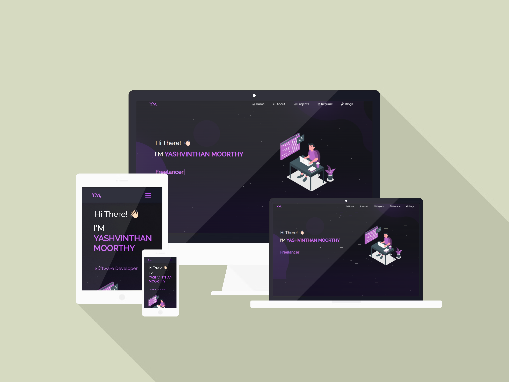

# -Personal-Portfolio-Website
 Developed a personal portfolio website to showcase my  projects and skills using HTML, CSS, and JavaScript.  Designed a responsive and user-friendly interface.  Implemented a contact form with JavaScript validation
<div align="center">
  
</div>
# Personal Portfolio Website

This is a personal portfolio website showcasing projects, blog posts, resume, and about information. The website is built with React and features a modern, responsive design with smooth navigation and interactive elements.

## Features

- Home page with introduction and overview
- Projects section showcasing various projects with images
- About section with personal and professional information
- Resume section displaying detailed resume information
- Blog section with multiple blog posts and individual post pages
- Preloader animation on initial load
- Responsive Navbar and Footer for easy navigation
- Smooth scrolling and scroll-to-top functionality

## Technologies Used

- React
- React Router DOM for client-side routing
- Bootstrap for responsive design and styling
- FontAwesome for icons
- Axios for HTTP requests
- React PDF for rendering PDF documents
- React GitHub Calendar for GitHub activity visualization
- React Icons for additional icon sets
- React Parallax Tilt for interactive UI effects
- Typewriter Effect for animated text
- React TSParticles for particle animations

## Installation

1. Clone the repository:
   ```bash
   git clone <repository-url>
   ```
2. Navigate to the project directory:
   ```bash
   cd Personal-Portfolio-Website
   ```
3. Install dependencies:
   ```bash
   npm install
   ```
4. Start the development server:
   ```bash
   npm start
   ```
5. Open your browser and go to `http://localhost:3000` to view the website.

## Build

To create a production build, run:

```bash
npm run build
```

The optimized build will be in the `build` folder.

## Project Structure

- `src/` - Source code for the React application
  - `components/` - React components organized by feature (Home, About, Projects, Blog, Resume, Navbar, Footer, etc.)
  - `Assets/` - Images, PDFs, and other static assets
  - `App.js` - Main application component with routing setup
  - `index.js` - Entry point for React rendering
  - `style.css`, `App.css` - Styling files
- `public/` - Public static files like `index.html`, favicon, manifest, etc.
- `package.json` - Project metadata and dependencies

## Usage

Navigate through the website using the Navbar. Explore the Home, Projects, About, Resume, and Blog sections. Click on individual blog posts to read more. The site is responsive and works well on desktop and mobile devices.

## Screenshots

Screenshots and images used in the project can be found in the `Images/` folder.

## License

This project is open source and available under the [MIT License](LICENSE).

## Contact

For any inquiries or feedback, please contact:

- Email: your.email@example.com
- GitHub: [your-github-profile](https://github.com/your-github-profile)

---
